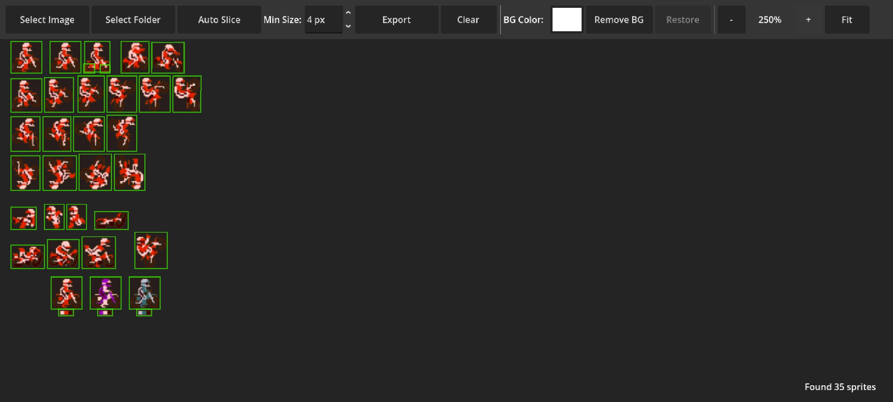

  

<h1 align="center">🎨 SpriteSlicer</h1>

  A cross-platform tool for slicing and combining 2D sprites

  
  
  

---

## 🚀 Overview

**SpriteSlicer** is a lightweight, cross-platform application designed for game developers and pixel artists.  
It allows you to efficiently manage 2D assets by slicing full sprite sheets into individual sprites or combining single sprites into a complete sprite sheet.

The tool works seamlessly on **Android**, **iOS**, and **Windows**, making it perfect for both desktop and mobile workflows.

---

## ✨ Features

- 🔪 Slice sprite sheets into individual sprites  
- 🧩 Combine single sprites into one sprite sheet  
- ✋ Manual region selection for precise slicing  
- 📂 Import sprites from folders  
- 💾 Export ready-to-use sprites  
- 📱 Desktop & mobile friendly workflow  
- ⚡ Fast, simple, and intuitive UI  

---

## 🔄 Workflows

### 🟦 Sprite Sheet → Single Sprites
Drop a full sprite sheet into the app and automatically cut it into separate sprites.

### 🟩 Single Sprites → Sprite Sheet
Select a folder with individual sprites and merge them into a single combined sprite sheet.

### ✍️ Manual Mode
Manually select and slice custom regions for non-uniform or complex sprite layouts.

---

## 🖥️ Supported Platforms

- ✅ **Android**
- ✅ **iOS**
- ✅ **Windows**

---

## 🎯 Ideal For

- 🎮 2D game development  
- 🖌️ Pixel art animation  
- 🧰 Asset preparation for **Godot**, **Unity**, **LibGDX**, and other engines  
- 📦 Organizing sprite libraries  

---

## 📸 Screenshots

  
  

